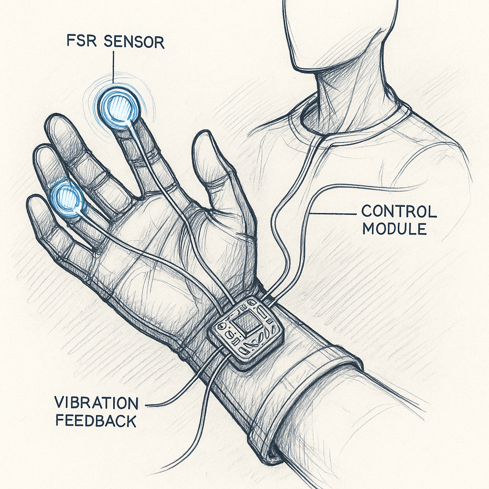
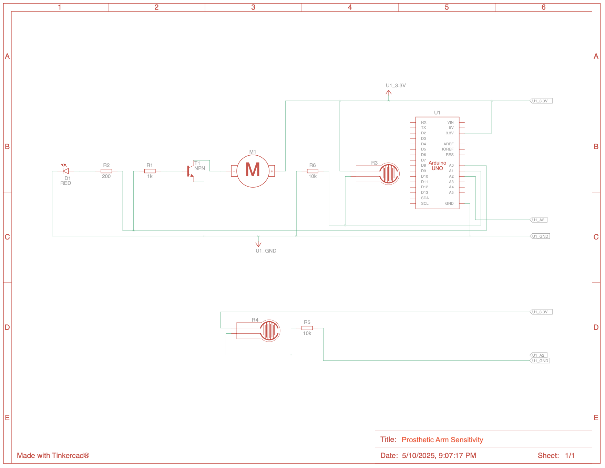
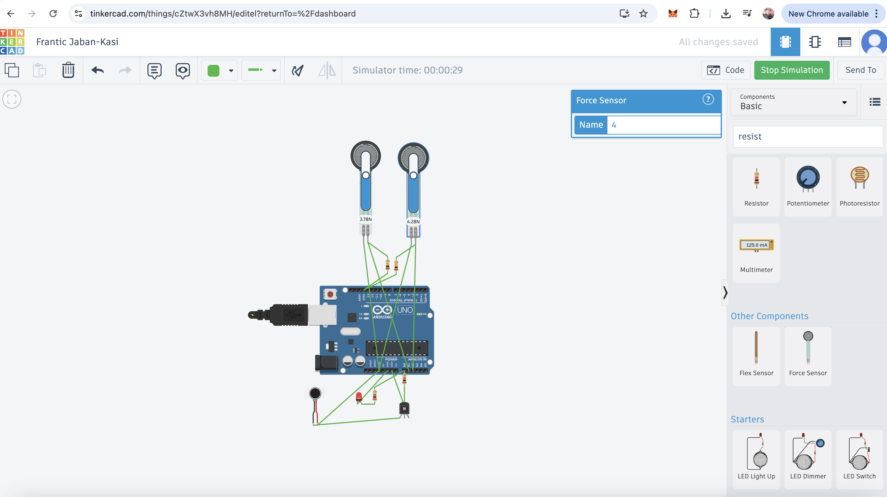
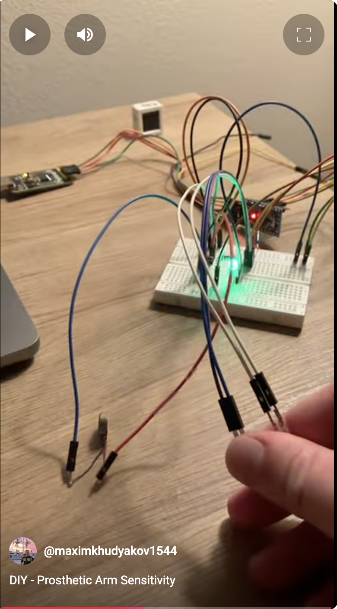

# Prosthetic Arm Sensitivity

## Vision

    

## Design

    

    

## Components

- [Pro Mini ATmega328P 3.3V 8M Module Board with Crystal Oscillator Compatible Arduino Pro Mini](https://www.amazon.com/dp/B08LNBYLBT)
- [FTDI USB UART IC FT232RL' USB to Serial Converter for Development Projects](https://www.amazon.com/dp/B075N82CDL) - to upload Arduino sketch through USB
- [Mini Vibration Motor](https://www.amazon.com/dp/B07PHRX7QH)
- [Thin Film Pressure Sensor 20g-2Kg High Sensitivity](https://www.amazon.com/dp/B0CZ6L5NMM)
- [2N2222 Transistor](https://www.amazon.com/dp/B0CBK1T5FQ)
- [Resistor 1KR](https://www.amazon.com/dp/B0BR6JNM1M)
- [Resistor 10KR](https://www.amazon.com/dp/B0CZJGR49F)
- [Resistor 220 ohm](http://amazon.com/dp/B07QK9ZBVZ)
- [LED](https://www.amazon.com/dp/B0CZ3XK1RH)

## Demo

